</img>

Welcome to my GitHub — I'm Nedesh Kumar M 👋, a final-year AI & DS undergrad  who's deeply, embarrassingly, and unapologetically obsessed with AI & Machine Learning — and it's a trait I was built with. For me, learning isn't a habit I built — it's the way I'm wired. And I've solved 800+ LeetCode problems down, and honestly? I'm still just getting started...

## My favorite tools and technologies ⚙️

> Tools and technologies that I have worked with and am interested in

<table>
  <tr>
    <td align="center" width="96">
      
       Python
    <td align="center" width="96">
        
       C
    </td>
    </td>
    <td align="center" width="96">
        
       Javascript
    </td>
    <td align="center" width="96">
        
       C++
    </td>
       <td align="center" width="96">
        
       Django
    </td>
       <td align="center" width="96">
        
       Github
    </td>
          <td align="center" width="96">
        
       Rest API
    </td>
          <td align="center" width="96">
        
       Docker
    </td>
    <td align="center" width="96">
        
       Flask
    </td>
  </tr>
  <tr>
    <td align="center" width="96">
        
       Git
    </td>
    <td align="center"  width="96">
        
       GitLab
    </td>
    <td align="center"  width="96">
        
       HTML
    </td>
    <td align="center" width="96">
        
       CSS
    </td>
    <td align="center"  width="96">
        
       Bootstrap
    </td>
    <td align="center" width="96">
        
       Tailwind
    </td>
        <td align="center" width="96">
        
       Tensorflow
    </td>
        <td align="center" width="96">
        
       PostgreSQL
    </td>
            <td align="center" width="96">
        
       Langchain
    </td>
  </tr>
   <tr>
    <td align="center" width="96">
        
       Numpy
    </td>
        <td align="center" width="96">
        
       Scikitlearn
    </td>
            <td align="center" width="96">
        
       keras
    </td>
    <td align="center" width="96">
        
       pandas
    </td>
    <td align="center" width="96">
        
       AWS
    </td>
    <td align="center" width="96">
        
       Mysql
    </td>
    <td align="center" width="96">
        
       Java
    </td>
    <td align="center" width="96">
        
       lang graph
    </td>
    <td align="center" width="96">
        
       Dialogflow
    </td>
  </tr>
 <tr>
 </tr>
</table>

